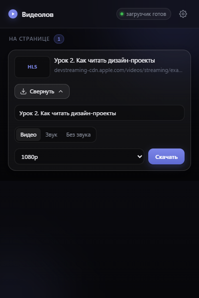

# Видеолов

Расширение для Яндекс.Браузера: находит видео на открытой странице и качает его
в 16 потоков. Бесплатно, без ограничений скорости.

Замена Video DownloadHelper. Обе его беды лечит одним приёмом: скачиванием
занимается не браузер, а `yt-dlp` с `ffmpeg` на твоём компьютере — они тянут
куски потока параллельно, а не по одному.

## Что умеет

- Ловит HLS (`.m3u8`), DASH (`.mpd`) и прямые файлы на ЛЮБОМ сайте — в том числе
  на закрытых курсах: куки вкладки уходят загрузчику вместе с заданием.
- Знает YouTube, VK, Rutube, Vimeo, Дзен, OK, Twitch, TikTok — там качает
  страницу целиком, с правильным названием и склейкой звука.
- Три режима: **видео со звуком**, **только звук**, **только видео**.
- Выбор качества из списка.
- Имя файла правится до старта, раскладка по папкам сайта.
- Обложка — КАДР ИЗ СЕРЕДИНЫ урока, а не картинка со страницы: у курсов там
  нарисован модуль целиком, одна и та же на десяток уроков.
- Загрузки одной лентой: идущие сверху, завершённые ниже, с кнопками «Играть»,
  «Папка», «Удалить». Готовая загрузка уходит в историю сама.

Чего НЕ умеет и не сможет: видео с защитой DRM (Widevine) — Кинопоиск, Netflix,
Okko. Там поток зашифрован ключом, который браузер держит в закрытом модуле;
это не обходится ничем, включая платные качалки.

## Установка

Нужны **Node.js**, **yt-dlp** и **ffmpeg**. На этом компьютере всё уже стоит.
Если ставить заново: `winget install yt-dlp.yt-dlp Gyan.FFmpeg OpenJS.NodeJS`.

1. **Помощник** — запустить `helper\установить.bat`.
   Он скопирует себя в `%LOCALAPPDATA%\Videolov` и пропишется в реестре для
   Яндекс.Браузера, Chrome, Chromium и Edge.
2. **Расширение** — `browser://extensions` → включить «Режим разработчика» →
   «Загрузить распакованное расширение» → выбрать папку `extension`.
3. Перезапустить браузер, если он был открыт.

Проверка: иконка Видеолова → в шапке должно гореть «помощник на месте».

Снять всё: `helper\удалить.bat` и удаление расширения на `browser://extensions`.

## Как выглядит



Оформление — «Modern Dark (Cinema)»: глубокий фон без чистого чёрного (на нём
прокрутка смазывается и проваливается контраст границ), стеклянная шапка с
размытием, карточки со скруглением 16 и бликом по верхней грани, мягкое
свечение под единственной главной кнопкой.

Токены лежат в `:root` файла `popup.css`, страница настроек берёт их оттуда же —
оформление одно на всё. Движение тоже одно: `cubic-bezier(0.16, 1, 0.3, 1)`,
160 мс на отклик и 260 мс на появление; при включённом системном «уменьшить
движение» анимации выключаются целиком.

Значки — рисунки Lucide, вшитые как SVG. Эмодзи не используются нигде: они
зависят от системного шрифта и не подчиняются цвету темы.

## Как устроено

```
Страница
   │ браузер грузит .m3u8 / .mp4
   ▼
Расширение (webRequest + осмотр страницы) ──► список найденного
   │ жмёшь «Скачать», выбираешь качество
   │ собирает адрес, куки, Referer, User-Agent
   ▼
Помощник (native messaging) ──► yt-dlp -N 16 ──► ffmpeg ──► mp4 в папке
   │
   └── обратно: проценты, скорость, «готово» / «ошибка»
```

Браузер сам запускает помощника при обращении и гасит, когда окно закрывается.
Ни фонового процесса, ни открытого порта: достучаться может только расширение с
известным идентификатором, он зашит в манифест помощника.

### Файлы

| Где | Что |
| --- | --- |
| `extension/background.js` | перехват сети, учёт находок, задания помощнику |
| `extension/lib/detect.js` | что считать видео, а что куском потока |
| `extension/lib/hls.js` | чтение мастер-плейлиста (быстрый список качеств) |
| `extension/lib/title.js` | заголовок страницы → имя файла для Windows |
| `extension/lib/store.js` | состояние (переживает сон фонового скрипта) |
| `extension/lib/helper.js` | связь с помощником |
| `extension/content/scan.js` | осмотр страницы: заголовок и `<video>` |
| `extension/popup.*` | окно: список, качество, прогресс, история |
| `extension/options.*` | настройки: папка, потоки, формат звука |
| `helper/host.js` | протокол native messaging |
| `helper/lib/ytdlp.js` | сборка аргументов, разбор прогресса, отмена |
| `helper/lib/cookies.js` | куки браузера → файл формата Netscape |
| `helper/lib/paths.js` | поиск yt-dlp, ffmpeg и настоящей папки «Загрузки» |
| `helper/lib/shell.js` | показать в проводнике, проиграть, удалить, выбрать папку |
| `helper/install.js` | установка и запись в реестр |

## Проверки

```
node tests/распознавание.mjs          # чистая логика, без сети — быстрая
node tests/связь-с-помощником.js      # кадры, probe и живая загрузка звука
node tests/установленный-помощник.js  # тот путь, которым идёт браузер
node tests/действия-с-файлами.js      # удаление бьёт по нужному файлу
node tests/сборка.mjs                 # старая начинка опознаётся
node tests/хранилище.mjs              # подстраховка хранилища
node tests/подсказки.mjs              # журнал перехвата и подсказки
python tests/плейлист-без-расширения.py  # случай GetCourse целиком
python tests/живая-проверка.py        # вся цепочка в настоящем браузере
```

Последняя — главная: поднимает браузер с расширением, открывает страницу с
потоком и проходит путь целиком, до файла на диске. Заодно кладёт в `docs/`
свежие снимки окна.

⚠ Живая проверка идёт на **Chromium из поставки Playwright**, а не на Chrome:
обычный Chrome с 137-й версии выбросил `--load-extension` совсем — расширение
молча не загружается, список на `chrome://extensions` пуст, ошибок нет.
Проверено на Chrome 152.

Проверки со скачиванием тянут тестовый поток Apple — несколько мегабайт.

## Грабли, оплаченные кровью

1. **Заголовки вне latin-1 роняют yt-dlp.** `Referer` берётся из адреса
   страницы, а адрес бывает с кириллицей — и загрузка падает с
   `UnicodeEncodeError`, ни словом не упоминая заголовки. Адреса переводятся в
   проценты (`latin1Header` в `ytdlp.js`).
2. **Имя файла из `--print` приходит в кодировке консоли.** Русское название
   возвращается кракозябрами, хотя на диске оно правильное; `PYTHONIOENCODING`
   на .exe-сборку не действует. Поэтому напечатанному пути верим только если он
   существует, иначе ищем файл в папке.
3. **Сессионной куке нельзя писать срок 0.** Разбор внутри yt-dlp читает ноль
   как «истекла в 1970-м» и молча выбрасывает куку — а именно такие куки держат
   авторизацию на курсах. Им ставится завтрашний день.
4. **Фоновый скрипт MV3 засыпает через 30 секунд.** Всё, что в переменных,
   пропадает: список найденного живёт в `chrome.storage.session`.
5. **`child.kill()` не убивает ffmpeg.** yt-dlp запускает его отдельным
   процессом, и тот продолжает писать файл. Отмена идёт через `taskkill /T /F`.
6. **Прогресс дважды доходит до ста процентов.** Видео и звук качаются подряд,
   счёт у каждого свой. Без подписи «дорожка 2» это выглядит поломкой.
7. **Node с 18.20 не запускает `.bat` напрямую** (`spawn EINVAL`) — это его
   защита, браузера она не касается. В проверках заходим через `cmd /c`.
8. **Кириллица в `.bat` ломается**: файл читается в кодировке OEM. Содержимое
   установщиков — только латиница, русский текст печатает `install.js` после
   `chcp 65001`.
9. **Отменённая загрузка воскресала.** Убитый yt-dlp успевает выплюнуть
   последние строки прогресса, и они возвращали карточке вид «качается» —
   навсегда, потому что больше событий не будет. Процесс при этом был мёртв,
   то есть человек смотрел бы на вечную полосу. Теперь событие прогресса не
   принимается, если загрузка уже не в работе, и помощник его не шлёт.
10. **Атрибут `hidden` перебивается любым `display` из стилей.** Пустое
   состояние с `display: flex` показывалось ОДНОВРЕМЕННО с найденным видео.
   Лечится правилом `[hidden] { display: none !important }`.
11. **Правка исходников помощника не действует на установленного.** Установщик
   его КОПИРУЕТ в `%LOCALAPPDATA%\Videolov`; после изменений в `helper/`
   надо заново запустить `node helper/install.js`, иначе браузер работает со
   старой версией, а выглядит это как «правка не помогла».
13. **Расширение `.m3u8` — привычка, а не правило.** GetCourse (на нём работает
   `curs.kudryavtsevtony.ru`) отдаёт плейлист как
   `/api/playlist/master/<хеш>/<хеш>?jwt=…` — без расширения и с типом, который
   про видео не говорит; куски называются `34.bin` и лежат в `/api/storage/chunk/`.
   Ни одной привычной приметы. Решает теперь не адрес, а СОДЕРЖИМОЕ: подозрительный
   адрес читается, и настоящий плейлист узнаётся по `#EXTM3U`. Проверка идёт
   только для запросов методом GET — повторять чужой POST нельзя.
14. **Один ролик под двумя адресами.** У GetCourse мастер и плейлист качества
   лежат в РАЗНЫХ папках (`/playlist/master/…` и `/playlist/media/…`), родства
   по вложенности нет — склеиваются по общим хешам в адресе (`mediaIdentity`),
   главным считается мастер.
15. **В Яндекс.Браузере нет кнопки «Обновить»** для распакованного расширения —
   в отличие от Chrome. Правка кода служебного скрипта не вступает в силу, а
   выглядит это как «исправление не помогло». Страницы расширения читаются с
   диска заново при каждом открытии, поэтому свежая страница сама замечает
   старую начинку и перезапускает её (`chrome.runtime.reload`).
16. **Подписка на события обязана быть в первый же миг жизни служебного скрипта.**
   Manifest V3 запоминает подписки по первому запуску и потом будит скрипт только
   ради них; поздняя подписка не учитывается. Тот же приём у Video DownloadHelper.
17. **`explorer.exe /select` ломается о кавычки Node.** Node сам заключает
   аргумент с пробелом в кавычки целиком — `"/select,C:\путь\Урок 6.mp4"`, —
   а проводнику нужны кавычки ВНУТРИ: `/select,"C:\путь\Урок 6.mp4"`. Он не
   ругается, а молча открывает «Документы». Лечится `windowsVerbatimArguments`.
   Диагноз подтвердился списком открытых окон: восемь штук на «Документах» —
   ровно неудачные нажатия кнопки «Папка».
18. **Находки могут затирать друг друга.** Добавление идёт «прочитал список —
   изменил — записал», и два плеера, стартующие одновременно, оба читают пустой
   список: второй затирает первого, на значке остаётся «1» вместо «2». Записи по
   вкладке выстроены в цепочку (`inQueue` в `background.js`).
12. **Окно перерисовывается каждые 250 мс во время загрузки** — полная замена
   содержимого выбрасывала бы поле с недописанным именем вместе с курсором.
   Набранное хранится отдельно, фокус и позиция курсора восстанавливаются.
